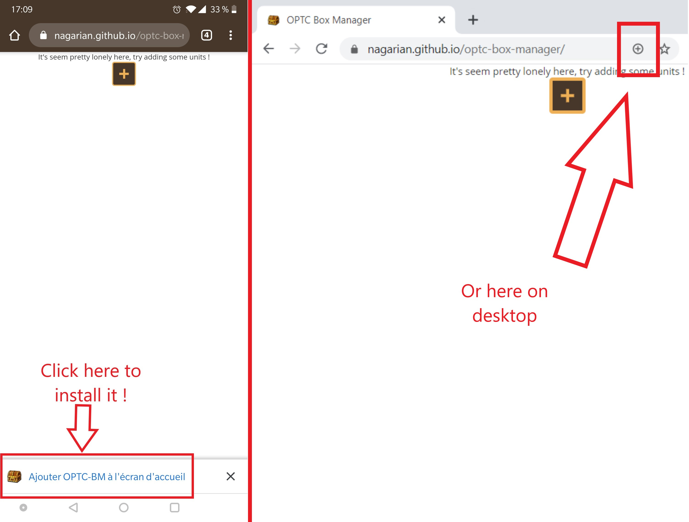

# OPTC Box Manager


This project exist in order to help you maintain your [One Piece Treasure Cruise](https://optc-ww.channel.or.jp/en/) box cleaned and tidy.
It's build on top of the [OPTC-DB project](https://github.com/optc-db/optc-db.github.io)

This is a [PWA app](https://web.dev/progressive-web-apps/) also you can install it on your phone, it will work as any other regular application you already have.

It is hosted on github pages [at this adress](https://nagarian.github.com/optc-box-manager/), although you can just download it and run a local copy

For a more detailed explanation of how this app works, you can also check out this video:

[](https://youtu.be/N9NX-BYk5bI)

## Installation

To install the PWA to your phone/computer

- open your favorite browser
- go to <https://nagarian.github.com/optc-box-manager/>
- you should see a popup appear to install it, or click on "..." > "Add to home screen"



## Development

This project was bootstrapped with [Create React App](https://github.com/facebook/create-react-app).

To learn React, check out the [React documentation](https://reactjs.org/).

### Schema validation

To generate schema validator we need to be outside of this npm project because typescript is messed-up with the config define in the project

```bash
cd ..
# for the old format
npx ts-json-schema-generator --path './optc-box-manager/src/models/old-units.ts' --type 'ExtendedUnit' -o './optc-box-manager/src/models/old-character-schema.json'
# for the new format
npx typescript-json-schema -o './optc-box-manager/src/models/character-schema.json' './optc-box-manager/src/models/character.ts' 'ExtendedCharacter' --required --noExtraProps --validationKeywords --strictNullChecks
```

### HTTPS mode

Follow <https://stackoverflow.com/questions/35127383/npm-http-server-with-ssl>

```bash
npm run build
npx http-server ./build -S
```
